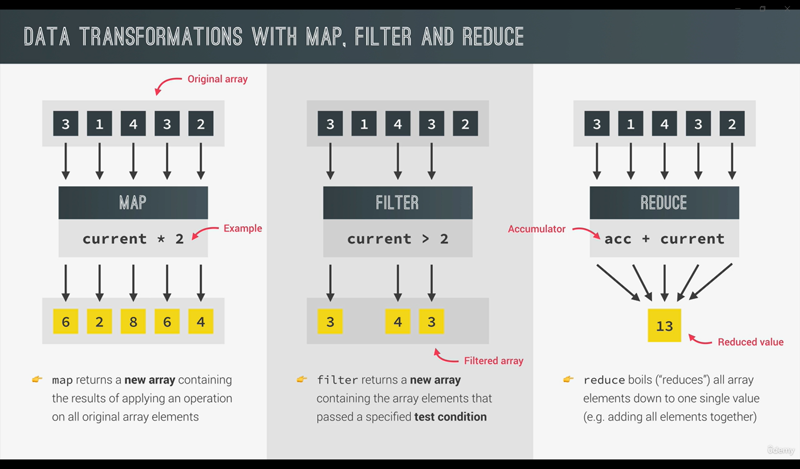

# Data Transformation with Map, Filter and Reduce

## Map

Map is similar to forEach method but the difference is that it creates a brand new array based on the original one.

## Filter

Filters the array based on some specified condition and returns the array with the elements which matched the condition

## Reduce

Reduces the array to a single value and returns that single value. Like adding all the elements of the array etc. In reduce we have an accumulator and the current element. In each iteration the element gets accumulated into the accumulator variable.

